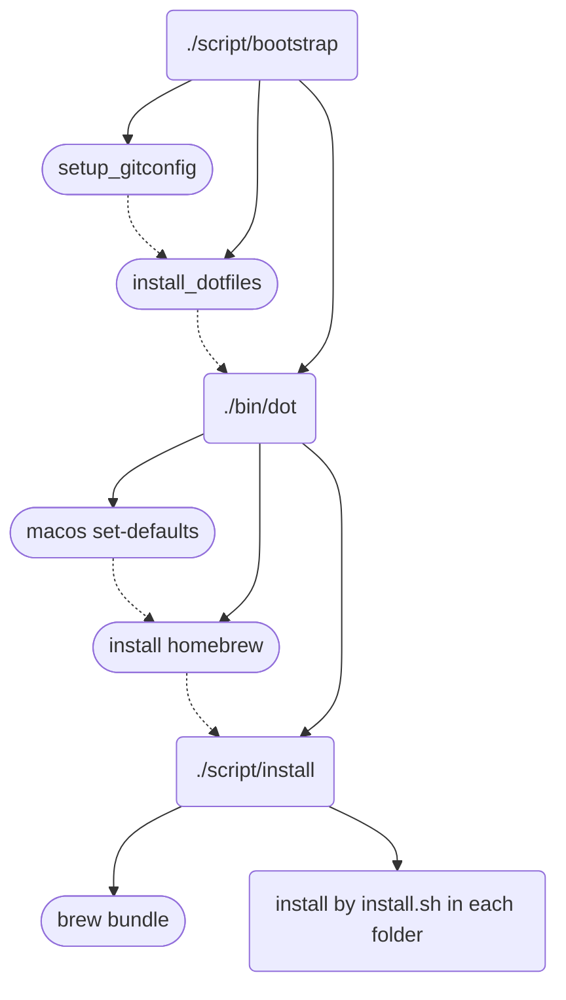

# dotfiles

cloned from [holman/dotfiles](https://github.com/holman/dotfiles)

```shell
.
├── Brewfile
├── Brewfile.lock.json
├── README.md
├── asdf
│   ├── asdfrc.symlink
│   ├── install.sh
│   └── tool-versions.symlink
├── bin
│   ├── battery-status
│   ├── dns-flush
│   ├── dot
│   ├── e
│   ├── ee
│   ├── git-all
│   ├── git-amend
│   ├── git-copy-branch-name
│   ├── git-credit
│   ├── git-delete-local-merged
│   ├── git-edit-new
│   ├── git-nuke
│   ├── git-promote
│   ├── git-rank-contributors
│   ├── git-track
│   ├── git-undo
│   ├── git-unpushed
│   ├── git-unpushed-stat
│   ├── git-up
│   ├── git-wtf
│   ├── gitio
│   ├── headers
│   ├── search
│   ├── set-defaults
│   └── todo
├── docker
│   └── aliases.zsh
├── functions
│   ├── _boom
│   ├── _brew
│   ├── _c
│   ├── _git-rm
│   ├── c
│   ├── extract
│   └── gf
├── git
│   ├── aliases.zsh
│   ├── completion.zsh
│   ├── gitconfig.local.symlink
│   ├── gitconfig.local.symlink.example
│   ├── gitconfig.symlink
│   └── gitignore.symlink
├── homebrew
│   ├── install.sh
│   └── path.zsh
├── macos
│   ├── set-defaults.sh
│   └── set-hostname.sh
├── script
│   ├── bootstrap
│   └── install
├── system
│   ├── _path.zsh
│   ├── aliases.zsh
│   ├── env.zsh
│   ├── grc.zsh
│   └── keys.zsh
├── xcode
│   └── aliases.zsh
└── zsh
    ├── aliases.zsh
    ├── completion.zsh
    ├── config.zsh
    ├── fpath.zsh
    ├── prompt.zsh
    ├── window.zsh
    └── zshrc.symlink

12 directories, 64 files

```

