# Dotfiles

Dotfiles are how you personalize your system. These are mine.

I personally install everything that does not need version management using [`Homebrew`](https://brew.sh), and install the others using [`asdf`](https://github.com/asdf-vm/asdf) for switching toolchain versions.

The repository is cloned from [**holman/dotfiles**](https://github.com/holman/dotfiles), **please read the README file in the original repository**.

Below are only the parts I extracted for reference when adding content.

## Components

There's a few special files in the hierarchy.

- `bin/`: Anything in `bin/` will get added to your `$PATH` and be made available everywhere.

- `topic/*.zsh`: Any files ending in `.zsh` get loaded into your environment.

- `topic/path.zsh`: Any file named `path.zsh` is loaded first and is expected to setup `$PATH` or similar.

- `topic/completion.zsh`: Any file named `completion.zsh` is loaded last and is expected to setup autocomplete.

- `topic/install.sh`: Any file named `install.sh` is executed when you run `script/install`. To avoid being loaded automatically, its extension is `.sh`, not `.zsh`.

- `topic/*.symlink`: Any file ending in `*.symlink` gets symlinked into your` $HOME`. This is so you can keep all of those versioned in your dotfiles but still keep those autoloaded files in your home directory. These get symlinked in when you run `script/bootstrap`.

## Flowchart

```mermaid

flowchart TD

    bootstrap(script/bootstrap) --> git_config([setup_gitconfig])
    git_config -.-> dotfiles
    bootstrap(script/bootstrap) --> dotfiles([install_dotfiles])
    dotfiles -.-> bin_dot
    bootstrap(script/bootstrap) --> bin_dot(./bin/dot)
    bin_dot(bin/dot) --> macos([macos/set-defaults.sh])
    macos -.-> brew
    bin_dot(bin/dot) --> brew([homebrew/install.sh])
    brew -.-> install
    bin_dot(bin/dot) --> install(script/install)
    install(script/install)--> bundle([brew bundle])
    install(script/install)--> install_sh(install using ⁠install.sh in each folder)

```

